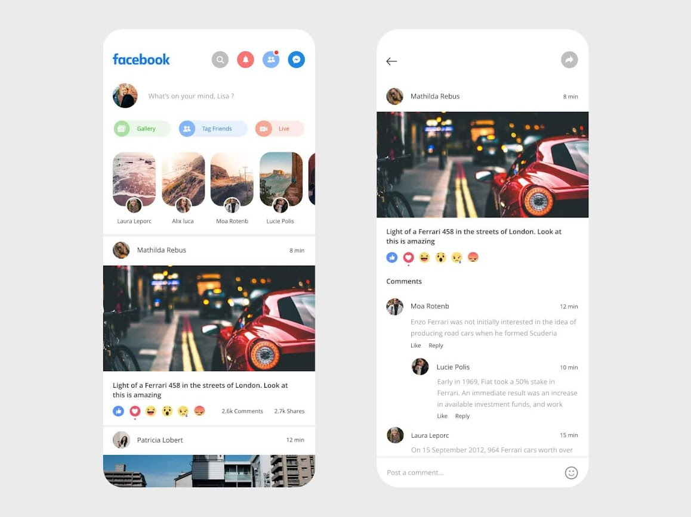

# Facebook UI (Seccion 5)

Este es un mini proyecto utilizando los widgets vistos en la [sección 5](https://github.com/ArturoDLG/notas_flutter/tree/main/seccion_5) de las lecciones 119 a 136
del curso.
En el se hace una replica de la UI de la app de Facebook basada en la siguiente imagen:

